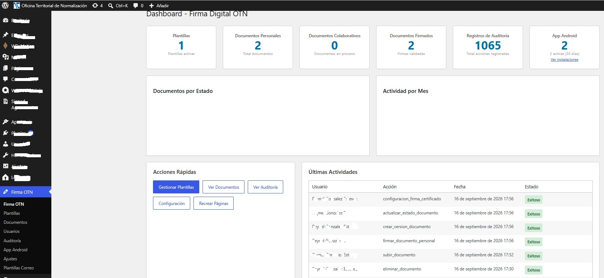
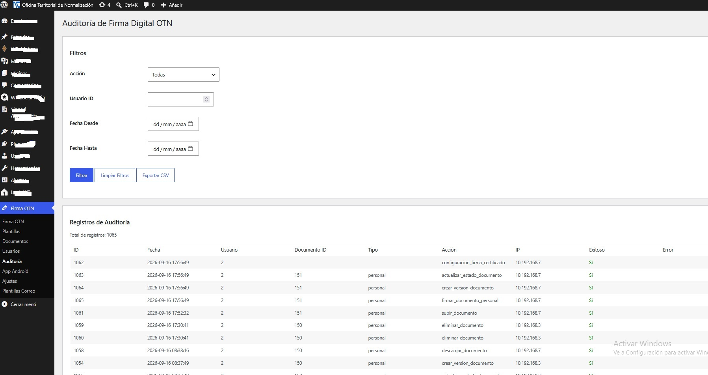
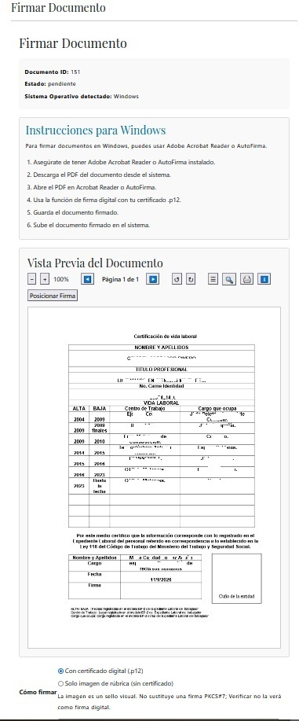
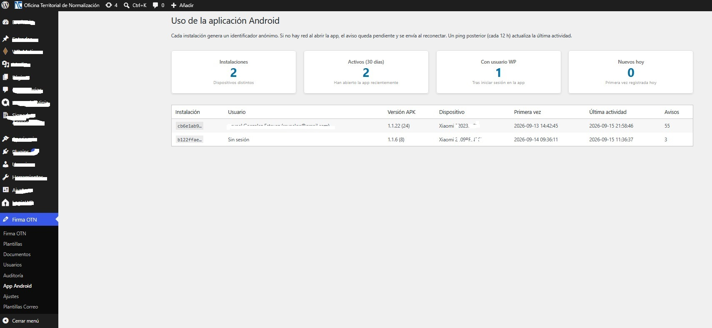
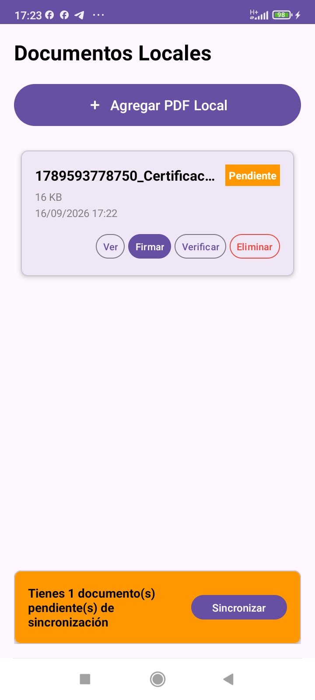
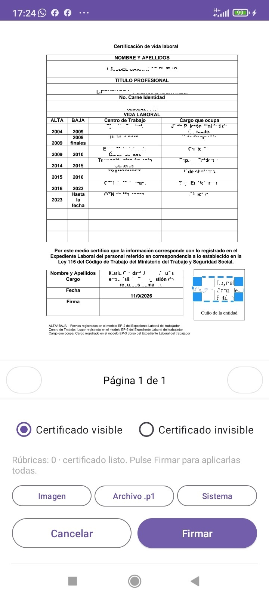
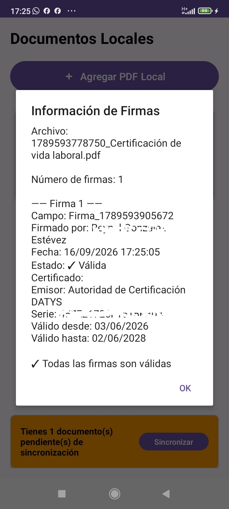
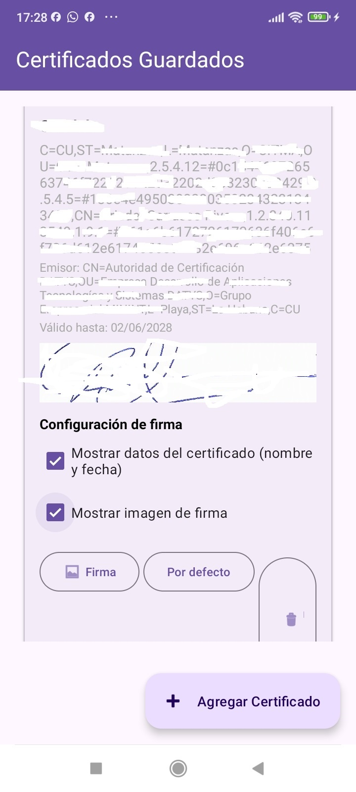

# Firma Digital OTN - Full Stack Showcase

Este repositorio es un **escaparate técnico** de un sistema completo de firma digital. El sistema está compuesto por dos aplicaciones que se comunican entre sí: un plugin personalizado para WordPress y una aplicación nativa para Android.

> **Nota:** El código fuente completo de este proyecto es privado. Este repositorio tiene como objetivo mostrar la arquitectura, las tecnologías utilizadas, las capturas de pantalla y fragmentos de código representativos.

## 🚀 Visión General del Sistema

El sistema permite a los usuarios crear, firmar y gestionar documentos digitales (PDF) con certificados digitales. Soporta flujos de firma secuenciales y paralelos para documentos colaborativos, así como firma de documentos personales.

### Arquitectura de la Solución
*   **Backend (WordPress):** Plugin personalizado que gestiona usuarios, roles, plantillas de documentos, auditoría y provee una API REST.
*   **Frontend (Android):** Aplicación nativa que consume la API REST, permite el llenado de plantillas, visualización de PDFs y firma digital offline/online.

## 🛠️ Stack Tecnológico

*   **Backend:** PHP, WordPress, MySQL, REST API, JWT (JSON Web Tokens).
*   **App Android:** Kotlin, Android SDK, MVVM, Clean Architecture, Dagger Hilt, Retrofit, Room Database, WorkManager.
*   **Firma Digital:** iText 7 (PDF), pdfium-android, Criptografía (OpenSSL, certificados .p12).
*   **Seguridad:** Validación MIME, Nonces, JWT, BiometricPrompt (Android), Validación CRL/OCSP.

## ✨ Características Principales

### Plugin WordPress (Backend)
*   Gestión de documentos personales y colaborativos.
*   Configuración de flujos de firma (secuencial/paralela).
*   Panel de auditoría con exportación a CSV.
*   Dashboard con estadísticas de uso.
*   Shortcodes para integración en el frontend del sitio.
*   API REST personalizada para la App Android.

### App Android (Frontend)
*   Autenticación segura con WordPress vía JWT.
*   Gestión de documentos locales y sincronización offline-first.
*   Visor de PDF integrado con pdfium.
*   Posicionamiento de firma visual (arrastrar y soltar).
*   Firma invisible y firma visual con imagen personalizada.
*   Integración con el KeyChain de Android y archivos .p12 externos.
*   Autenticación biométrica para mayor seguridad.

## 📸 Capturas de Pantalla

### Backend (Plugin WordPress)
*   **Dashboard de Estadísticas:** 
*   **Panel de Auditoría:** 
*   **Firma de Documentos vía Web:** 
*   **Monitoreo de la App Android:** 

### App Android (Kotlin)
*   **Gestión de Documentos Locales:** 
*   **Visor PDF y Posicionamiento de Firma:** 
*   **Validación Criptográfica de Firmas:** 
*   **Gestión de Certificados y Rúbricas:** 

## 💻 Fragmentos de Código Destacados

Puedes explorar la calidad del código y la arquitectura del proyecto en los siguientes archivos:

### Backend (PHP)
*   [Registro de API REST y Validación JWT](code-snippets/backend_php/seguridad_api.md)
*   [Cifrado de Certificados Digitales](code-snippets/backend_php/cifrado_certificados.md)
*   [Lógica de Firma de PDFs](code-snippets/backend_php/firma_pdf_fallback.md)

### App Android (Kotlin)
*   [Lógica de Firma de PDFs con iText 7](code-snippets/android_kotlin/firma_pdf_logic.md)
*   [Inyección de Dependencias con Hilt](code-snippets/android_kotlin/inyeccion_dependencias.md)

## 👨‍💻 Mi Rol en el Proyecto
Desarrollador Full Stack. Responsable de la arquitectura, diseño, desarrollo e integración de la App Android y el Plugin WordPress.

## 📄 Licencia
Este proyecto es una muestra de portafolio. Todos los derechos reservados.
